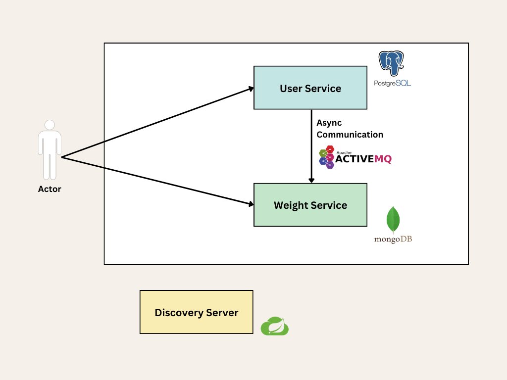

# Calokilo [](https://github.com/yeanci/calokilo#readme)
Calokilo is fitness tracker API that offers users the ability to manage their weight, record their meals and track their calorie intake.
Why this project ? Because it's going to be part of an open-source application that will give people control over their health data. 


<details open="open">
  <summary>Table of Contents</summary>
  <ol>
    <li><a href="#getting-started">Getting started</a></li>
    <li><a href="#usage">Architecture</a></li>
    <li><a href="#built-with">Built with</a></li>
  </ol>
</details>


## Getting started

### 1. Clone the repository
```shell
git clone https://github.com/yeanci/calokilo.git
```
```shell
cd calokilo
```

### 2. Start the project
[Docker](https://docs.docker.com/get-docker/) is required to run all the microservices of the project.

At the root of the project, you will find a `.env` file containing all the needed information that will be injected in containers' environement. You can edit it as you wish.  

To start the project, it is as easy as running this command :
```shell
docker compose up
```
You can explore user service at `localhost:8080/swagger-ui.html`<br>
You can explore weight service at `localhost:8081/swagger-ui.html`


## Architecture




## Built with

* [Spring Boot](https://spring.io/projects/spring-boot)
* [Spring Cloud](https://spring.io/cloud/)
* [Spring Data](https://spring.io/projects/spring-data/)
* [Swagger](https://swagger.io/)
* [ActiveMQ](https://activemq.apache.org/)
* [PostgreSQL](https://www.postgresql.org/)
* [Mongo DB](https://www.mongodb.com/)
* [Docker](https://www.docker.com/)
* [Maven](https://maven.apache.org/)
* [Lombok](https://projectlombok.org/)
* [TestContainers](https://testcontainers.com/)
* [Mockito](https://site.mockito.org/)

